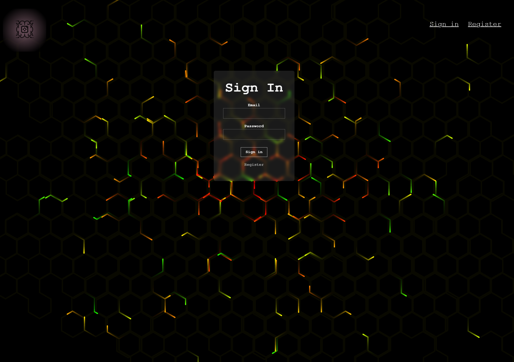
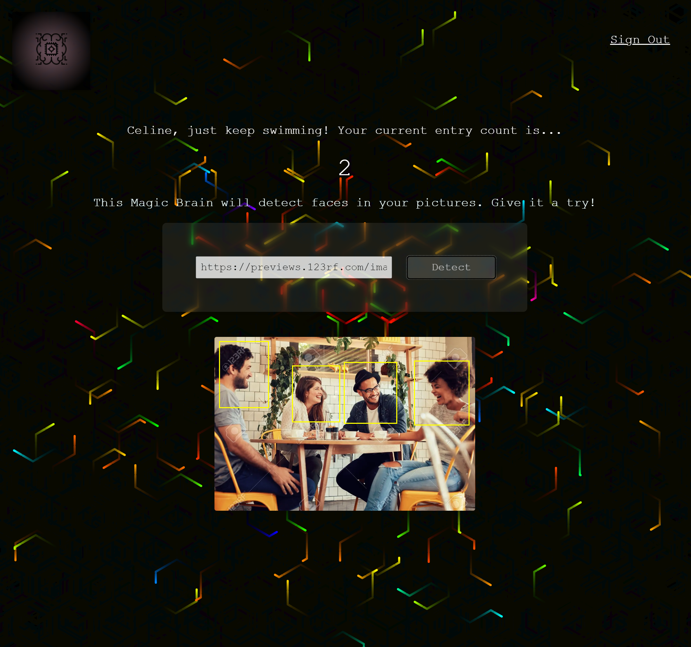

# FACE RECOGNITION 

The app uses the Clarifai API to detect faces on photo's. The data collected from the API helps to create a frame around each face.
This project is the final exercice of the Web Developer course from Zero to Mastery. 
The repository "Face recognition" contains the Front-End, the one called "Face recognition API" contains the Back-End.

## Demo

https://face-recognition-front-mm4d.onrender.com/

How to use the app:
1) Register or login in if you are already registered.
2) Past the URL of a jpg image into the form.
3) Click detect.

The frame(s) is/are now visible!

## Screenshots

## Tech Stack

**Client:** React, Tachyons

**Server:** Node, Express, Postman

**Database:** PostgreSQL, PgAdmin

**Deployement:** Render

## Lessons Learned

Because I followed a tutorial to build this project, we could believe it was easy. Well it was easier than without tutorial, but easy? Nop!

First of all, as this is the last project of the course, it is on a very different level than the other exercices in the course. While the other exercices were 'doable', this project pushed me to discover new tools as Node, database, hidding password using bcrypt, or deploy on internet.

The tutorial is 5 years old now, and several libraries used are now depreciated. It was not a simple "code along", this project asks me a lot of research on my own along the way to get it done.

## Related

 - [Zero To mastery](https://zerotomastery.io/)
 - [Matteo Bruni](https://github.com/matteobruni/tsparticles/blob/main/components/react/README.md)
 - [Clarifai](https://github.com/Clarifai/clarifai-javascript)

